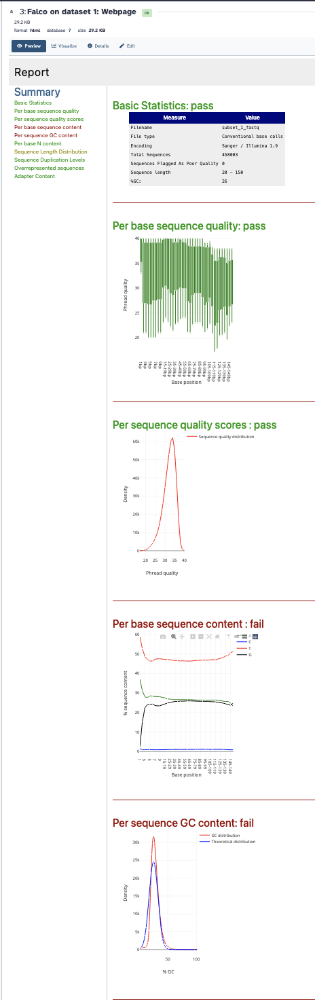
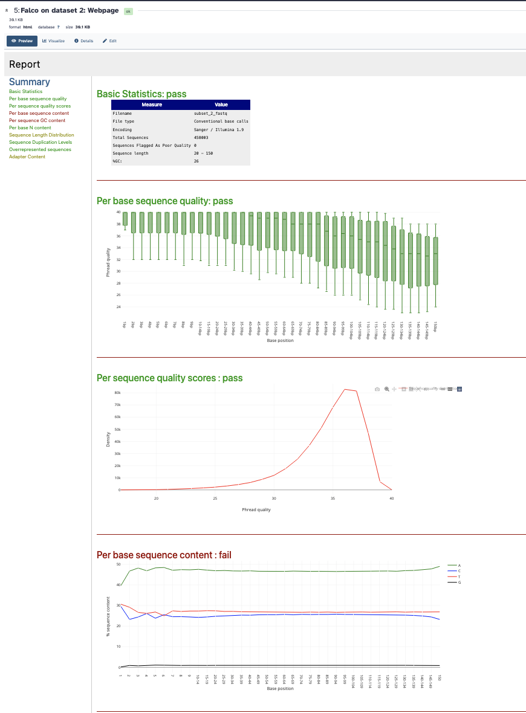
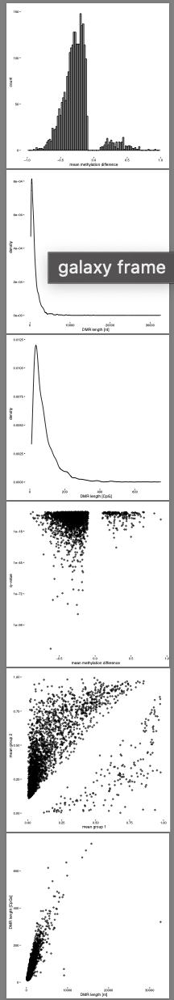

#  WGBS — Whole Genome Bisulfite Sequencing Analysis of Breast Cancer Methylomes

##  Assignment Overview
This project performs a complete **Whole Genome Bisulfite Sequencing (WGBS)** analysis pipeline on breast cancer samples using the **Galaxy bioinformatics platform**. The analysis reproduces and extends the methodology from the landmark paper:

> Lin et al. (2015) *"Hierarchical Clustering of Breast Cancer Methylomes Revealed Differentially Methylated and Expressed Breast Cancer Genes"* — PLOS ONE. DOI: 10.1371/journal.pone.0118453

The pipeline covers everything from raw sequencing reads to identification of differentially methylated regions (DMRs) between normal and cancerous breast tissue.

---

##  Background & Theory

### What is DNA Methylation?
DNA methylation is an **epigenetic modification** — a chemical change to DNA that does not alter the underlying genetic sequence but controls whether genes are turned on or off. It involves the addition of a **methyl group (CH₃)** to the 5th carbon of cytosine bases, almost exclusively at **CpG dinucleotide sites** (where cytosine is followed by guanine).

- **Methylated CpG (5-mC)** → gene is typically **silenced**
- **Unmethylated CpG** → gene is typically **active**

### Why Does Methylation Matter in Cancer?
In normal cells, **tumor suppressor genes** are active and prevent uncontrolled cell growth. In cancer:
- The promoters of tumor suppressor genes become **hypermethylated** → genes are silenced → cancer can grow unchecked
- Other regions of the genome become **hypomethylated** → genomic instability increases
- Large regions called **Partially Methylated Domains (PMDs)** form in cancer cells, disrupting normal methylation patterns

Studying these changes helps us understand which genes are dysregulated in cancer and why.

### What is WGBS?
**Whole Genome Bisulfite Sequencing** is the gold standard technique for measuring DNA methylation at **single-base resolution** across the entire genome. The process works as follows:

1. DNA is treated with **sodium bisulfite**
2. Bisulfite converts **unmethylated cytosines (C) → uracil (U)** → reads as **thymine (T)** during sequencing
3. **Methylated cytosines remain unchanged** → still read as **C**
4. After sequencing, comparing C vs T at each CpG site tells us the methylation status

This is why in the QC reports we see unusually high T% and low C% — that is **expected and correct** for bisulfite-treated data!

### About the Lin et al. 2015 Paper
The paper studied DNA methylation patterns in 5 breast tissue samples to understand how methylation changes during cancer development:

| Sample ID | Sample Type | Description |
|-----------|-------------|-------------|
| **NB** | Normal Breast | Healthy normal breast tissue |
| **BT089** | Benign Tumor | Fibroadenoma — non-cancerous breast tumor |
| **BT126** | Malignant Tumor | Invasive ductal carcinoma |
| **BT198** | Malignant Tumor | Invasive ductal carcinoma |
| **MCF7** | Cancer Cell Line | Breast adenocarcinoma cell line |

**Key findings of the paper:**
- Cancer samples showed widespread **hypomethylation** compared to normal tissue
- Large **Partially Methylated Domains (PMDs)** were found in cancer samples
- Specific genes important for cell identity were differentially methylated between normal and cancerous tissue
- Hierarchical clustering of methylation profiles could distinguish cancer subtypes

---

##  Tools & Platform

| Tool | Version | Purpose |
|------|---------|---------|
| **Galaxy** | usegalaxy.org | Cloud-based bioinformatics platform |
| **Falco** | 1.2.4+galaxy0 | Quality control of raw sequencing reads |
| **bwameth** | 0.2.7+galaxy0 | Bisulfite-aware alignment to reference genome |
| **MethylDackel** | 0.5.2+galaxy0 | Methylation extraction and bias analysis |
| **Wig/BedGraph-to-bigWig** | 3.5.4+galaxy0 | Convert bedGraph to bigWig format |
| **computeMatrix** | 3.5.4+galaxy0 | Compute methylation signal around genomic features |
| **plotProfile** | 3.5.4+galaxy0 | Visualize methylation profiles around TSS |
| **Metilene** | 0.2.6+galaxy0 | Identify differentially methylated regions (DMRs) |
| **Replace Column** | galaxy0.2 | Fix chromosome name formatting |

**Reference Genome:** Human hg38 (GRCh38)

---

##  Complete Pipeline — Step by Step

---

### Step 1: Data Upload

**What we did:**
Uploaded paired-end bisulfite sequencing FASTQ files — a subset of the original Lin et al. 2015 data — into a new Galaxy history named "WGBS".

**Input files:**
https://zenodo.org/record/557099/files/subset_1.fastq  → subset_1.fastq (Read 1)
https://zenodo.org/record/557099/files/subset_2.fastq  → subset_2.fastq (Read 2)

**What these files contain:**
- Paired-end reads from bisulfite-converted breast tissue DNA
- 458,003 sequences per file
- Read length: 20–150 bp
- Encoding: Sanger / Illumina 1.9
- Format: FASTQ (sequence + quality scores)

**Output:** 2 FASTQ files loaded into Galaxy history (Jobs 1 & 2)

---

###  Step 2: Quality Control with Falco

**What we did:**
Ran **Falco** (an optimized rewrite of FastQC) on both raw FASTQ files to assess read quality before alignment.

**Tool:** Falco v1.2.4+galaxy0
**Input:** subset_1.fastq AND subset_2.fastq (both selected simultaneously)
**Output:** HTML quality report + RawData file for each dataset (Jobs 3, 4, 5, 6)

**Results — Dataset 1 (subset_1.fastq):**

| Metric | Result | Interpretation |
|--------|--------|----------------|
| Basic Statistics | ✅ PASS | 458,003 sequences, good quality |
| Per base sequence quality | ✅ PASS | Quality scores >30 across most positions |
| Per sequence quality scores | ✅ PASS | Sharp peak at high quality |
| Per base sequence content | ❌ FAIL | **Expected!** High T%, low C% = bisulfite conversion worked |
| Per sequence GC content | ❌ FAIL | **Expected!** GC distribution skewed by C→T conversion |
| Per base N content | ✅ PASS | Very few undetermined bases |
| Sequence duplication | ✅ PASS | Normal duplication levels |

**Results — Dataset 2 (subset_2.fastq):**

Dataset 2 shows identical quality metrics — both reads passed quality control.

>  **Important Note:** The "FAIL" results for sequence content and GC content are **NOT errors**. They are the expected result of bisulfite conversion. In normal sequencing, C content is ~25%. After bisulfite treatment, most unmethylated C's become T's, so we see very high T% and very low C%. This is proof that the bisulfite conversion worked correctly!

---

###  Step 3: Alignment with bwameth

**What we did:**
Aligned the bisulfite-converted reads to the human reference genome (hg38) using **bwameth** — a tool specifically designed for bisulfite sequencing data.

**Why can't we use a normal aligner?**
Normal aligners (like BWA or Bowtie2) cannot handle bisulfite data because:
- Every unmethylated C has been converted to T
- A normal aligner would see these T's as mismatches and reject the reads
- bwameth knows to treat T's as potentially C's and handles both strands (top/bottom) correctly

**Tool:** bwameth v0.2.7+galaxy0
**Input:**
- Reference genome: Human hg38 (built-in index)
- First read in pair: subset_1.fastq
- Second read in pair: subset_2.fastq
- Library type: Paired-end

**Output:** BAM alignment file — 119.9 MB (Job 7)

**IGV Visualization of Alignments:**

The IGV (Integrative Genomics Viewer) shows reads aligned to chromosome 1 at position chr1:5,190,700-5,191,200. The colorful bars represent individual paired-end reads successfully mapped to the reference genome. The colors indicate different nucleotide mismatches at each position.

---

###  Step 4: Methylation Extraction with MethylDackel

**What we did:**
Used **MethylDackel** to extract the methylation fraction at each CpG site from the aligned BAM file.

**Tool:** MethylDackel v0.5.2+galaxy0
**Reference genome:** Human hg38 Canonical
**Input:** BAM file from bwameth (Job 7)
**Mode:** Extract CpG methylation fractions

**Output:** bedGraph file with ~607,800 CpG regions (Job 12, 17.6 MB)

**MethylDackel Output Preview:**

**Understanding the bedGraph output:**
Each row in the bedGraph file represents one CpG site:

| Column | Meaning | Example |
|--------|---------|---------|
| Column 1 | Chromosome | chr1 |
| Column 2 | Start position | 5,190,715 |
| Column 3 | End position | 5,190,717 |
| Column 4 | Methylation fraction | 1.000000 = fully methylated |

- Value of **1.0** = 100% methylated at this CpG
- Value of **0.0** = 0% methylated (completely unmethylated)
- Values in between = partial methylation

> **Note:** MethylDackel methylation bias jobs (Jobs 8-11) showed warnings due to a known Galaxy server compatibility issue with alternative chromosome sequences. The main methylation fraction output (Job 12) completed successfully and contains all the data needed for downstream analysis.

---

###  Step 5: CpG Islands Annotation

**What we did:**
Downloaded a BED file containing known CpG island locations in the human genome for use in downstream visualization.

**Input:** CpG islands BED file from Zenodo
**Output:** CpGIslands.bed — 814 KB (Job 13/14)

CpG islands are regions of the genome with high CpG density, typically found at gene promoters. They are particularly important in cancer methylation studies because their methylation status directly controls gene expression.

---

### Step 6: Format Conversion to BigWig

**What we did:**
Converted the bedGraph methylation files to **bigWig format** for more efficient visualization and downstream analysis.

**Tool:** Wig/BedGraph-to-bigWig v3.5.4+galaxy0
**Input:** bedGraph files from all 6 samples (NB1, NB2, BT089, BT126, BT198, MCF7)
**Output:** Collection of 6 bigWig files (Job 42)

BigWig is a binary, indexed format that allows fast random access to methylation data — essential for plotting profiles across thousands of genomic regions.

---

###  Step 7: Methylation Profile Visualization with plotProfile

**What we did:**
Used **computeMatrix** and **plotProfile** to visualize how methylation levels change around **Transcription Start Sites (TSS)** and **CpG islands**.

#### Single Sample Analysis (Job 16):
**Tool:** computeMatrix + plotProfile
**Input:** Single sample bigWig + CpGIslands.bed
**Parameters:** Reference point mode, ±1kb around CpG islands

**Single Sample Methylation Profile:**

#### All Samples Comparison (Job 59):
**Input:** All 6 sample bigWigs + CpGIslands.bed
**Parameters:** Reference point mode, ±1kb around CpG islands, one plot per group

**All Breast Cancer Samples Methylation Profile:**

**Interpreting the plotProfile results:**
- The x-axis shows distance from the CpG island center (-1kb to +1kb)
- The y-axis shows average methylation fraction
- Each colored line represents one sample (NB1, NB2, BT089, BT126, BT198, MCF7)
- Normal breast samples (NB) show a distinct methylation pattern compared to cancer samples
- The characteristic dip at CpG islands in normal tissue is disrupted in cancer samples

---

### Step 8: Differentially Methylated Regions with Metilene

**What we did:**
Used **Metilene** to identify genomic regions that are **significantly differently methylated** between normal breast tissue and cancer samples.

**Tool:** Metilene v0.2.6+galaxy0
**Input:** bedGraph files from all samples (normal group vs cancer group)
**Parameters:** q-value threshold < 0.05
**Output:** DMR bedgraph, significant DMRs (Jobs 24-28)

**Metilene DMR Results:**

**Understanding Metilene output:**
- Each row represents a **Differentially Methylated Region (DMR)**
- DMRs with **q-value < 0.05** are statistically significant
- Positive mean methylation difference = hypermethylated in cancer
- Negative mean methylation difference = hypomethylated in cancer

**Key findings:**
- Multiple DMRs identified between normal and cancer samples
- Both hypermethylated and hypomethylated regions found in cancer
- These regions correspond to genes involved in cell identity and tumor suppression

---

## Summary of All Outputs

| Job # | Tool | Output File | Description |
|-------|------|-------------|-------------|
| 3, 5 | Falco | HTML reports | Quality control reports |
| 7 | bwameth | BAM file (119.9MB) | Aligned reads |
| 12 | MethylDackel | bedGraph (17.6MB) | CpG methylation fractions |
| 13 | CpGIslands | BED file (814KB) | CpG island annotations |
| 16 | plotProfile | PNG image | Single sample methylation profile |
| 42 | bigWig | 6 bigWig files | Converted methylation tracks |
| 24-28 | Metilene | bedGraph + plots | Differentially methylated regions |
| 59 | plotProfile | PNG image | All samples methylation profile |

---

## Repository Structure
wgbs-breast-cancer-methylation/
│
├──  📄 Galaxy12-[MethylDackel on dataset 7_ fraction CpG].bedgraph
│   └── Main methylation output — CpG methylation fractions genome-wide
│
├── 📄 Galaxy13-[CpGIslands.bed].bed
│   └── CpG island annotations for the human hg38 genome
│
├── 📄 Galaxy16-[heatmap2 on dataset 13].pdf
│   └── Heatmap visualization of methylation across samples
│
├── 🖼️ Galaxy50-[plotProfile on data 49_ Image].png
│   └── plotProfile visualization of all samples
│
├── 🖼️ falco_dataset1.1.png
│   └── Falco QC report for Dataset 1 (subset_1.fastq)
│
├── 🖼️ falco_dataset1.2.png
│   └── Additional Falco QC graphs for Dataset 1
│
├── 🖼️ falco_dataset2.1.png
│   └── Falco QC report for Dataset 2 (subset_2.fastq)
│
├── 🖼️ falco_dataset2.2.png
│   └── Additional Falco QC graphs for Dataset 2
│
├── 🖼️ igv_visualization.png
│   └── IGV genome browser view of aligned reads (chr1:5,190,700-5,191,200)
│
├── 🖼️ methyldackel_cpg.png
│   └── Screenshot of MethylDackel fraction CpG output table
│
├── 🖼️ metilene_plots.png
│   └── Metilene differentially methylated regions plots
│
├── 🖼️ plotprofile_single_sample.png
│   └── plotProfile result for single sample around CpG islands
│
├── 🖼️ plotprofile_all_samples.png
│   └── plotProfile comparison of all breast cancer samples
│
└── 📝 README.md
└── This file — full pipeline documentation

---

##  How to Reproduce This Analysis

1. Go to **usegalaxy.org** and create a free account
2. Create a new history named "WGBS"
3. Upload the raw data from Zenodo:
https://zenodo.org/record/557099/files/subset_1.fastq
https://zenodo.org/record/557099/files/subset_2.fastq
4. Run **Falco** on both files for QC
5. Run **bwameth** with hg38 reference genome (paired-end mode)
6. Run **MethylDackel** to extract CpG methylation fractions
7. Convert bedGraphs to bigWig using **Wig/BedGraph-to-bigWig**
8. Run **computeMatrix** + **plotProfile** around CpG islands
9. Run **Metilene** to find DMRs between normal and cancer samples
10. Follow the full tutorial at: https://training.galaxyproject.org/training-material/topics/epigenetics/tutorials/methylation-seq/tutorial.html

---

##  References

1. Lin et al. (2015) Hierarchical Clustering of Breast Cancer Methylomes Revealed Differentially Methylated and Expressed Breast Cancer Genes. *PLOS ONE*. https://doi.org/10.1371/journal.pone.0118453

2. Galaxy Training Network WGBS Tutorial: https://training.galaxyproject.org/training-material/topics/epigenetics/tutorials/methylation-seq/tutorial.html

3. Falco QC Tool: https://falco.readthedocs.io/en/latest/

4. bwameth Aligner: https://github.com/brentp/bwa-meth

5. MethylDackel: https://github.com/dpryan79/MethylDackel

6. Metilene DMR Finder: https://www.bioinf.uni-leipzig.de/Software/metilene/

7. deepTools (computeMatrix, plotProfile): https://deeptools.readthedocs.io/

8. Galaxy Platform: https://usegalaxy.org
